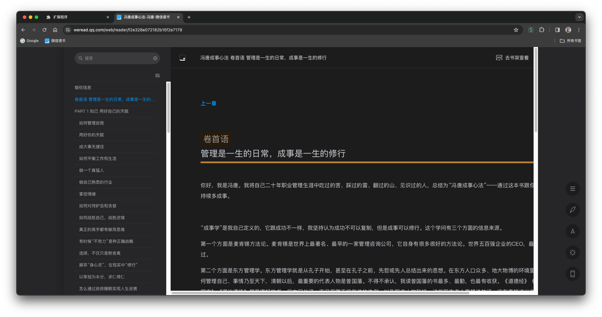
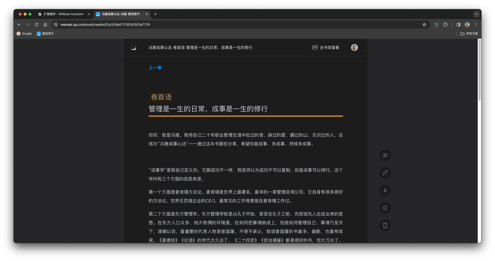
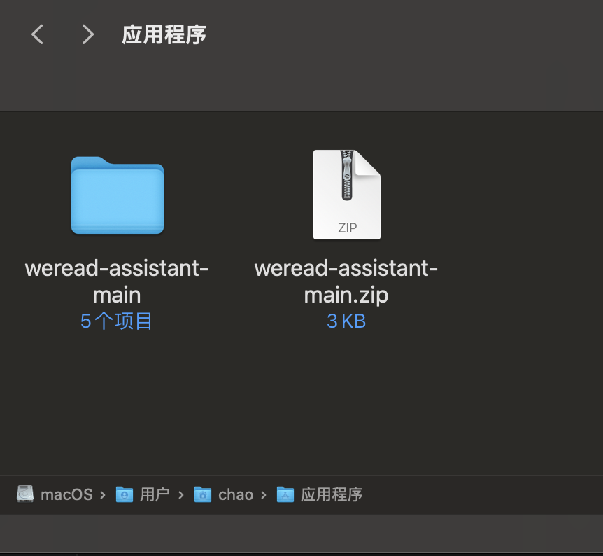
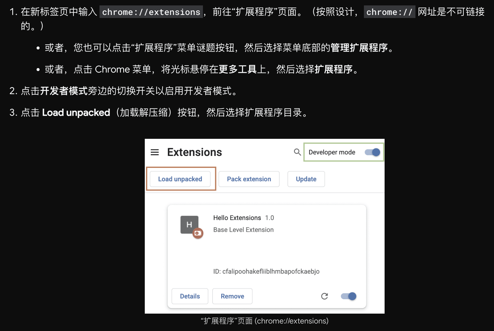

# 微信阅读助手

一个浏览器扩展，用于提升微信阅读（网页版）阅读体验，支持谷歌 Chrome、微软 Edge 等浏览器。

## 功能

1. 在正文页面左侧始终显示目录，以方便快速切换章节、查找内容。

启用扩展后的效果图：

启用扩展前的效果图：

## 安装

1. 从链接 [archive/main.zip](archive/main.zip) 下载整个项目的 ZIP 包，然后解压缩，最后保存到本地电脑的一个目录里。

如下图，将项目文件夹“weread-assistant-main”，保存到了用户目录下的“应用程序”目录。

2. 按照以下说明加载扩展，其中“扩展程序目录”就是上个步骤保存的项目文件夹。

